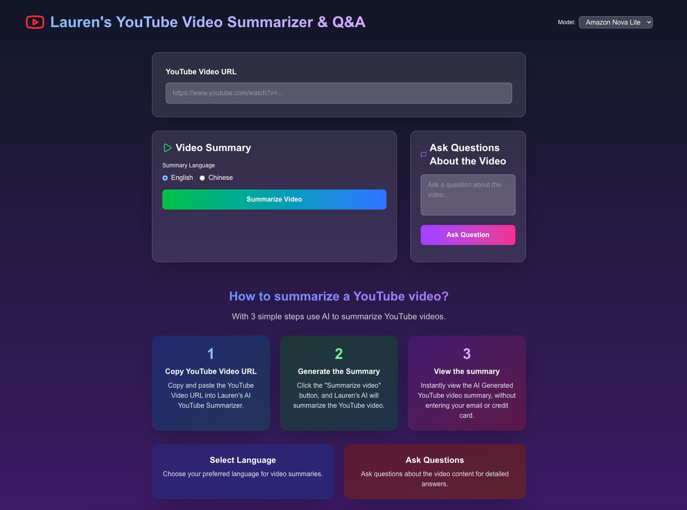

# Lauren's YouTube Video Summarizer & Q&A



An AI-powered web application that allows users to summarize YouTube videos and ask questions about their content using advanced language models. **Fully deployable on Vercel** with optimized transcript extraction.

## Features

- **Video Summarization**: Generate concise summaries of YouTube videos in English or Chinese
- **Q&A System**: Ask specific questions about video content and get AI-powered answers
- **Multi-language Support**: Choose between English and Chinese for summaries
- **Multiple AI Models**: Select from various AI models including Amazon Nova Lite, Arcee Trinity Mini, and Kat Coder Pro
- **Free to Use**: No credit card or email required
- **Responsive Design**: Modern, mobile-friendly interface optimized for desktop, tablet, and mobile
- **Vercel-Compatible**: Uses LangChain's YoutubeLoader for reliable transcript extraction in serverless environments

## Tech Stack

- **Frontend**: Next.js 16, React 19, TypeScript
- **Styling**: Tailwind CSS 4
- **AI Integration**: OpenRouter API (access to multiple AI models)
- **Transcript Extraction**: LangChain's YoutubeLoader (`@langchain/community`)
- **Language Processing**: LangChain with OpenAI integration
- **Icons**: Lucide React
- **Deployment**: Vercel-optimized

## Why LangChain YoutubeLoader?

This project uses **LangChain's YoutubeLoader** for transcript extraction because:

- ✅ **Works reliably on Vercel** - Compatible with serverless environments
- ✅ **No YouTube API scraping issues** - Uses stable APIs that aren't blocked
- ✅ **Consistent performance** - Works the same locally and in production
- ⚠️ **Other libraries** like `youtube-transcript-plus` and `youtubei.js` may fail on Vercel due to:
  - Request blocking from Google's video endpoints
  - Serverless environment incompatibilities
  - Cookie and session management issues

## Prerequisites

- Node.js 18 or higher
- npm, yarn, pnpm, or bun
- OpenRouter API key (for AI model access)

## Installation

1. Clone the repository:
```bash
git clone https://github.com/yuqiao1205/youtube_video_summarizer_qa
cd youtube_video_summarizer_qa
```

2. Install dependencies with legacy peer deps flag (required for LangChain packages):
```bash
npm install --legacy-peer-deps
# or
yarn install
# or
pnpm install --legacy-peer-deps
# or
bun install
```

## Environment Setup

1. Create a `.env` file in the root directory
2. Add your OpenRouter API key:
```
OPENROUTER_API_KEY=your_openrouter_api_key_here
```

You can get an API key from [OpenRouter](https://openrouter.ai/).

## Usage

1. Start the development server:
```bash
npm run dev
# or
yarn dev
# or
pnpm dev
# or
bun dev
```

2. Open [http://localhost:3000](http://localhost:3000) in your browser

3. To use the application:
   - Paste a YouTube video URL into the input field
   - Select your preferred summary language (English or Chinese)
   - Choose an AI model from the dropdown
   - Click "Summarize Video" to generate a summary
   - Or use the Q&A section to ask specific questions about the video

## How It Works

1. **Transcript Extraction**: Uses LangChain's YoutubeLoader to fetch video transcripts
   - Extracts video ID from YouTube URL
   - Fetches transcript using Vercel-compatible methods
   - Returns clean, formatted text content

2. **AI Processing**: Selected AI models via OpenRouter process the transcript
   - Supports multiple language models
   - Context-aware processing

3. **Summarization**: Generates structured summaries with key points
   - Language selection (English/Chinese)
   - Bullet-point format with highlights

4. **Q&A**: Provides context-aware answers to user questions based on video content
   - Uses transcript as context
   - Model generates relevant answers

## Deployment on Vercel

This application is optimized for Vercel deployment:

1. **Connect your repository** to Vercel
2. **Add environment variable**:
   - `OPENROUTER_API_KEY`: Your OpenRouter API key

3. **Deploy**:
   - Vercel will automatically detect Next.js
   - Uses the `vercel.json` configuration for proper build settings
   - Installs packages with `--legacy-peer-deps` flag

### Vercel Configuration

The project includes a `vercel.json` file with:
```json
{
  "installCommand": "npm install --legacy-peer-deps"
}
```

This ensures all LangChain dependencies are installed correctly.

## Building for Production

```bash
npm run build
npm start
```

Or deploy directly to Vercel:
```bash
npm install -g vercel
vercel --prod
```

## Troubleshooting

### Transcript Extraction Issues

If you encounter transcript extraction errors:

1. **Verify the video has captions** - Not all videos have transcripts
2. **Check YouTube URL format** - Should be `https://www.youtube.com/watch?v=VIDEO_ID`
3. **LangChain dependencies** - Ensure `@langchain/core` and `@langchain/community` are installed

### Vercel Deployment Issues

1. **Missing environment variables** - Add `OPENROUTER_API_KEY` in Vercel dashboard
2. **Build failures** - Ensure `--legacy-peer-deps` is set in install command
3. **Runtime errors** - Check Vercel function logs for details

## Project Structure

```
youtube_video_summarizer_qa/
├── src/
│   ├── app/
│   │   ├── page.tsx          # Main UI component
│   │   ├── layout.tsx         # Root layout
│   │   └── globals.css        # Global styles
│   └── lib/
│       ├── transcript.ts      # LangChain YoutubeLoader integration
│       ├── summarize.ts       # AI summarization logic
│       └── qa.ts             # Q&A functionality
├── public/                    # Static assets
├── vercel.json               # Vercel configuration
└── package.json              # Dependencies
```

## Contributing

Contributions are welcome! Please feel free to submit a Pull Request.

## License

This project is private and proprietary.

## Credits

Built with ❤️ using Next.js, LangChain, and OpenRouter AI
